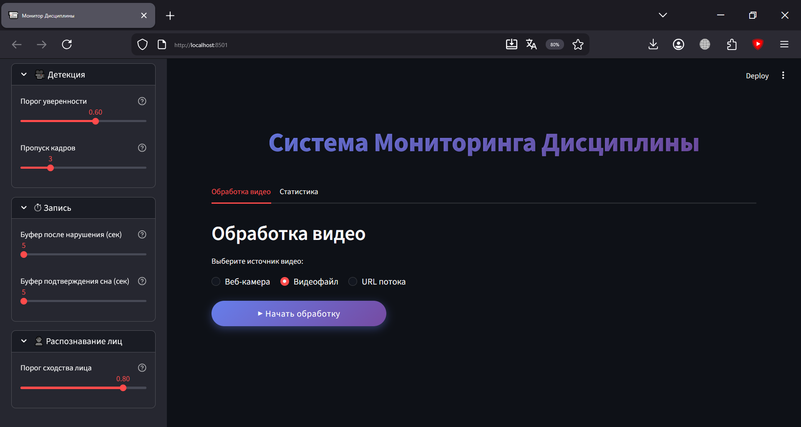

# Система мониторинга дисциплины на занятиях

Веб-приложение для автоматического обнаружения нарушений дисциплины
с использованием компьютерного зрения и нейросетевых моделей.

## Возможности

- Детекция нарушений: сон, использование телефона, еда/напитки
- Поддержка веб-камеры, видеофайлов и URL-потоков
- Журнал нарушений в реальном времени
- Настраиваемые параметры детекции

## Демонстрация

## Технологии

- Python 3.10+
- Streamlit
- YOLO (Ultralytics)
- OpenCV
- streamlit-webrtc

## Установка и запуск

### Требования
- Python 3.10 или выше
- Веб-камера (для соответствующего режима)

### Установка

1. Создание виртуального окружения

   python -m venv .venv .venv\Scripts\activate

2. Установите зависимости:
   pip install -r requirements.txt

3. Запустите приложение:
   streamlit run app.py

4. Откройте в браузере: http://localhost:8501

## Использование

### 1. Веб-камера
- Нажмите "Включить веб-камеру"

### 2. Видеофайл
- Загрузите MP4/AVI/MOV/MKV файл

### 3. URL поток
- Введите URL потока (RTSP, HTTP, файл)

## Структура проекта

- `app.py` - главное приложение
- `requirements.txt` - зависимости
- `best.pt` - модель YOLO
- `students.pkl` - база лиц студентов
- `modules/` - модули
- `monitor_output/` - выводимые файлы

## Автор

Демачев Артём

